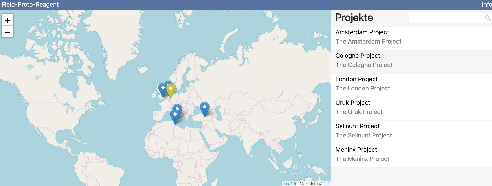
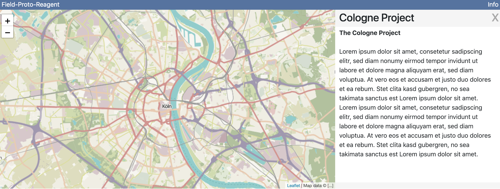

# field-proto-reagent




This at the moment is a proof of concept to selecting useful stuff for building clojure fullstack webapps.
. This here is a Single Page Application Frontend. It uses

* ClojureScript
* Reagent
* Hiccup
* Garden
* Figwheel
* Lein

The basic setup was made with lein reagent template. The I added garden. Together, everything
is up and running and autoreloadable with 2 commands. Server code is hotswapped. Frontend code
is handled by figwheel. Css with garden.

## Development

In one terminal window, run

```
lein figwheel
```

Fighwheel watches for changes and recompiles automatically. Look at [http://localhost:3449](http://localhost:3449).


In another terminal window, run

```
lein garden auto (or lein garden once)
```

The changes are immediately visible when saving the garden file.


## Autogenerated Text


### Development mode

To start the Figwheel compiler, navigate to the project folder and run the following command in the terminal:

```
lein figwheel
```

Figwheel will automatically push cljs changes to the browser. The server will be available at  once Figwheel starts up.

Figwheel also starts `nREPL` using the value of the `:nrepl-port` in the `:figwheel`
config found in `project.clj`. By default the port is set to `7002`.

The figwheel server can have unexpected behaviors in some situations such as when using
websockets. In this case it's recommended to run a standalone instance of a web server as follows:

```
lein do clean, run
```

The application will now be available at [http://localhost:3000](http://localhost:3000).


#### Optional development tools

Start the browser REPL:

```
$ lein repl
```
The Jetty server can be started by running:

```clojure
(start-server)
```
and stopped by running:
```clojure
(stop-server)
```


### Building for release

```
lein do clean, uberjar
```
