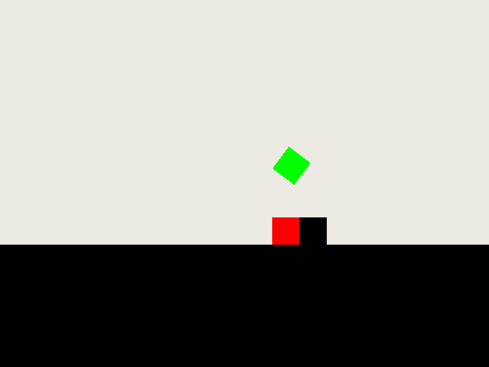

# clojure-gameloop

This simple gameloop was build to quickly get started with other project later on,
for example a reinforcement learning testbed.



The screenshot shows a first PoC scenario. The red ball gets shot from
left to right, kicking the black ball of its place. The green ball falls
to the place where the black one was. The goal is to choose the right force
for the red ball so that the green ball lands on the red ball.

## Prerequisites

* Clojure
* Leiningen

## Start

```
lein run
```

## Description

Currently there is

- a game loop
- simple 2d graphics (java.awt canvas + JFrame)
- a simple physics sim (dyn4j)
- a squary ball shot by an invisible cannon, landing on a plane
- a scenario with a test to evaluate if it was successful


